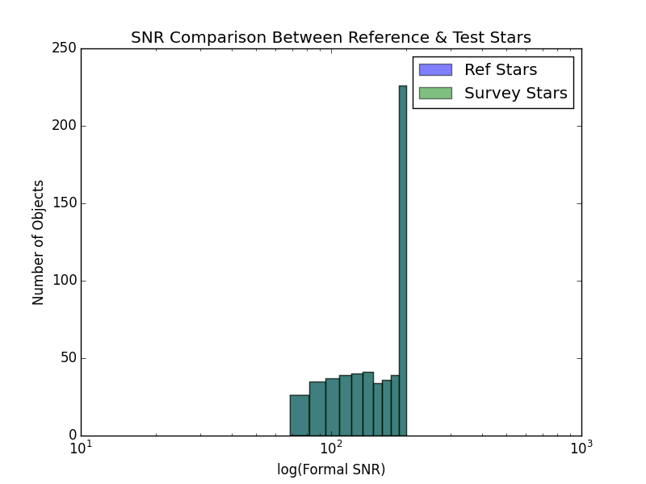
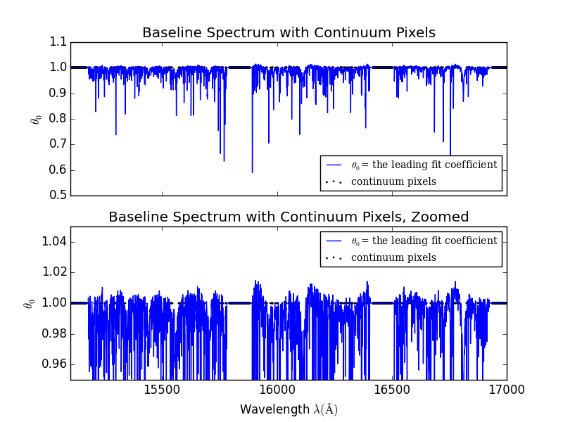
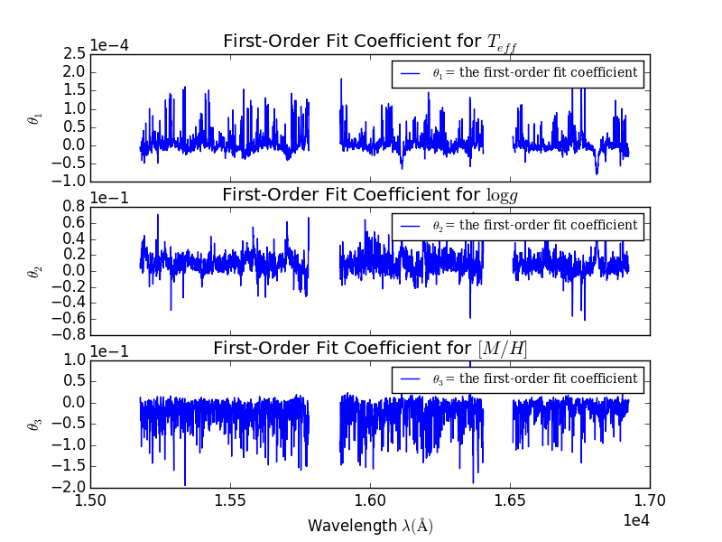
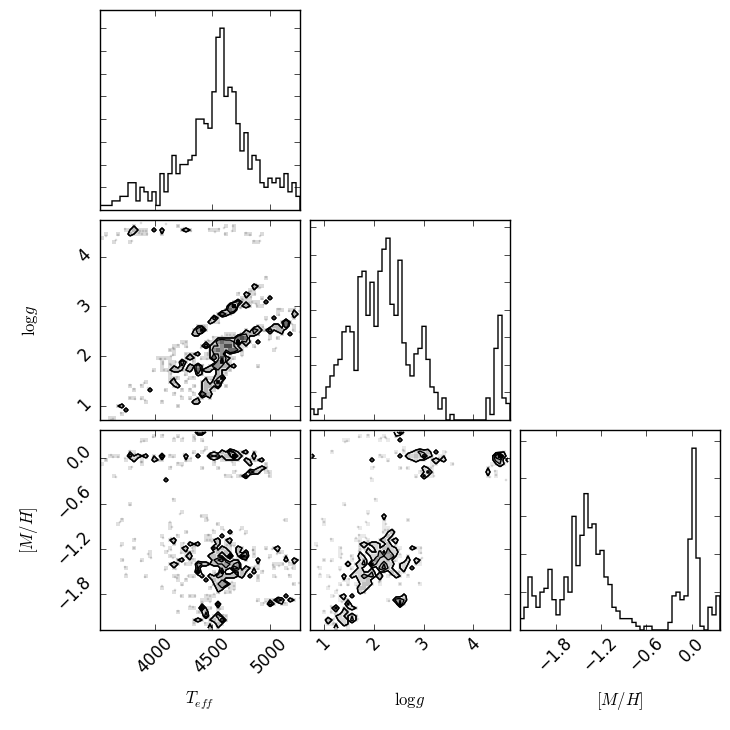
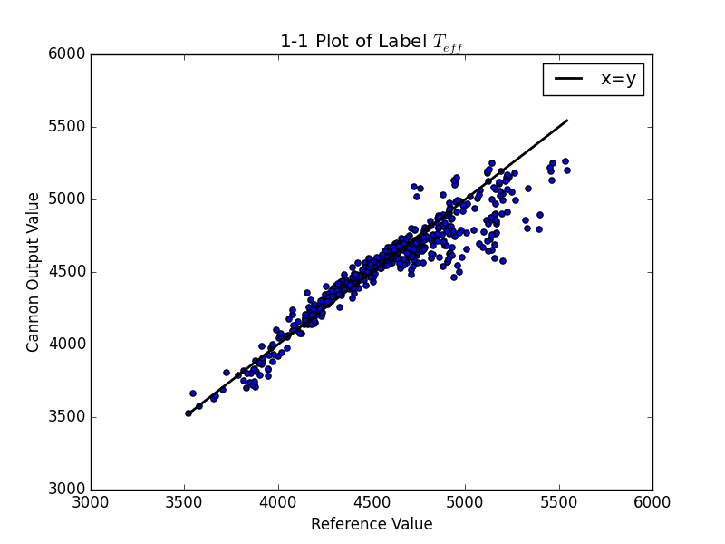
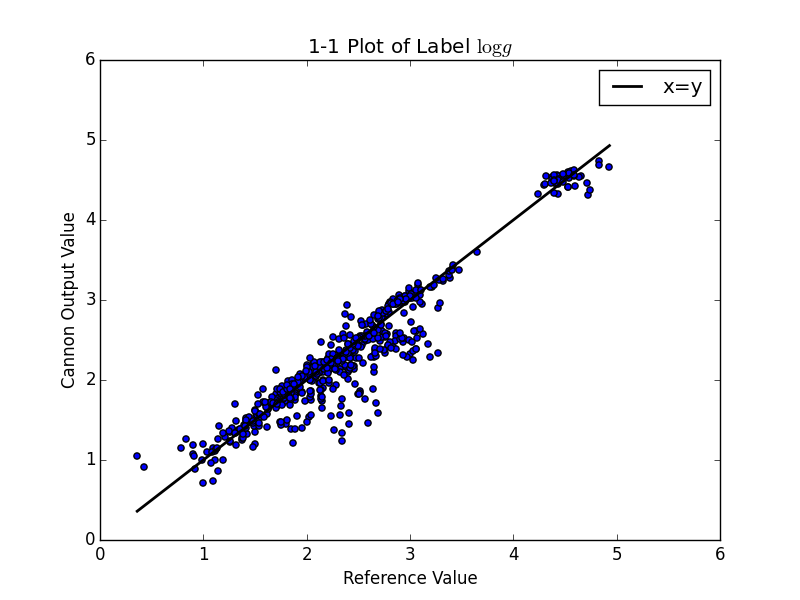
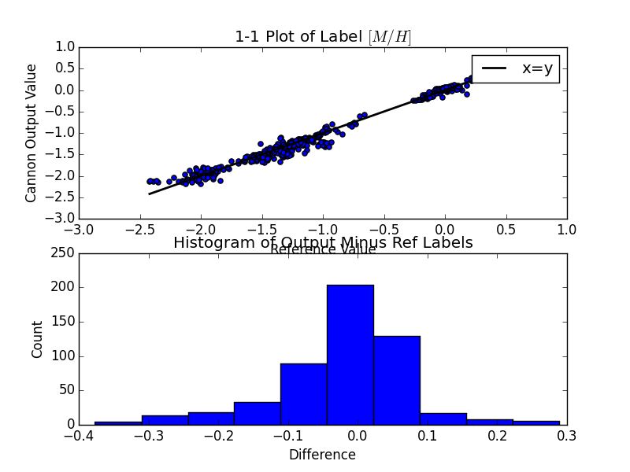
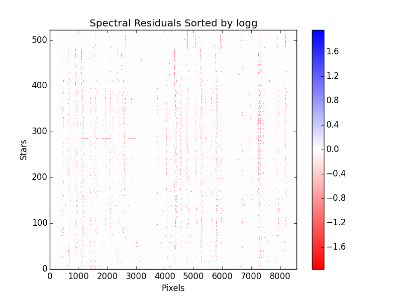
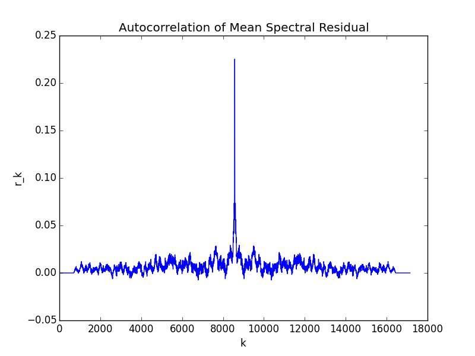

*****************************************
*The Cannon*: Data-Driven Stellar Labels
*****************************************

Introduction
============

This is the software package used for *The Cannon*,
a data-driven approach to determining stellar labels (parameters
and abundances) for a vast set of stellar spectra. This version is tailored 
specifically for APOGEE spectra.

A brief overview of *The Cannon* and the associated software package is below. 
For more details on the method and its successful application to APOGEE DR10
spectra, see Ness et al. 2015.

Introduction to *The Cannon* 
----------------------------

*The Cannon* has two fundamental steps that together constitute a 
process of *label transfer.* 

1. The *Training Step*: *reference stars* are a subset of the 
   survey for which labels are known with high fidelity, 
   for calib reasons or otherwise. Using both the spectra and labels for 
   these objects, *The Cannon* solves for a flexible model that describes 
   how the flux in every pixel of any given continuum-normalized spectrum 
   depends on labels. 
   
2. The *Test Step*: the model found in Step 1 is assumed to hold for all of 
   the objects in the survey, including those outside the reference stars 
   (dubbed *survey stars*). Thus, the spectra of the survey stars and 
   the model allow us to solve for - or infer - the labels of the survey 
   stars. 

Overview of *The Cannon* Software
---------------------------------

This software package breaks up *The Cannon* into the following steps and methods.

#. Construct reference stars from APOGEE files
   
   * ``get_spectra``: read spectra, continuum-normalize
   * ``get_reference_labels``: retrieve stellar IDs, reference label names and values
   * ``choose_labels``: (optional) select a subset of labels
   * ``choose_spectra``: (optional) select a subset of spectra  
   * ``reference_set_diagnostics``: (optional) run a set of diagnostics 
     on the reference stars

#. Construct test stars from APOGEE files

   * ``get_spectra``: read spectra, continuum-normalize
   * ``choose_spectra``: (optional) select a subset of spectra

#. *The Cannon*'s Training Step: Fit Model

   * ``train_model``: solve for model
   * ``model_diagnostics``: run a set of diagnostics on the model

#. *The Cannon*'s Test Step: Infer Labels

   * ``infer_labels``: infer labels using model
   * ``test_set_diagnostics``: run a set of diagnostics on the inferred labels

#. Cannon-generated spectra (``spectral_model``)

   * ``draw_spectra`` in ``spectral_model``
   * ``diagnostics`` in ``spectral_model``

Using *The Cannon*
==================

The details of using this package are provided in the following 
sections, along with an example of usage. In the example, the reference stars
consists of 553 open and globular cluster stars from APOGEE DR10 and, 
for simplicity, the same set of stars as the survey stars. 

Step 1: Construct a set of reference object from APOGEE files 
-------------------------------------------------------------

The reference stars in the survey under consideration
are those which the user has spectra and also high-fidelity labels (that is,
stellar parameters and element abundances that are deemed both accurate
and precise.) The set of reference stars is critical, as the label 
transfer to the survey stars can only be as good as the quality of the
reference stars. 

The user must construct the following inputs: 

1. a list of filenames corresponding to the reference data 
   (in this case, APOGEE .fits files) 
2. a .txt file containing reference labels in an ASCII table. 

The following requirements govern (2):

1. The first row must be strings corresponding to the names of the labels 
   and must not contain any '/'s 
2. The first column must be strings corresponding to the stellar IDs
3. The remaining entries must be floats corresponding to the label values

1a. Reading spectra (``get_spectra``)
+++++++++++++++++++++++++++++++++++++

We construct the first input: the list of filenames corresponding to the 
reference stars (in this case, APOGEE .fits files). In our example, the filenames
happen to be the first column in the reference labels text file, 
``reference_labels.txt``. So we simply read the first column of this file.

    >>> import numpy as np
    >>> readin = "reference_labels.txt"
    >>> IDs = np.loadtxt(readin, usecols=(0,), dtype='string', unpack=1)
    >>> filenames1 = []
    >>> for i in range(0, len(IDs)): #incorporate file location info
    >>> ....filename = '/home/annaho/AnnaCannon/Data/APOGEE_Data' + IDs[i][1:]
    >>> ....filenames1.append(filename)

Once the file list is created, the ``get_spectra`` method can be               
used to continuum-normalize the spectrum information and put it 
into the correct format. ``get_spectra`` also returns the fitted
continua (Chebyshev polynomial) and a list of SNR values for the 
spectra.

    >>> from read_apogee import get_spectra
    >>> lambdas, normalized_spectra, continua, SNRs = get_spectra(filenames1)

1b. Reading labels (``get_reference_labels``)
+++++++++++++++++++++++++++++++++++++++++++++

We construct the second input: the .txt file containing reference labels in an 
ASCII table, with requirements described above. In this example, the .txt file
is called ``reference_labels.txt``. The method ``get_reference_labels`` is used 
to retrieve object IDs, label names, and label values.

    >>> from read_labels import get_reference_labels
    >>> IDs, all_label_names, all_label_values = get_reference_labels(readin)

1c. Creating & tailoring a ``Dataset`` object (``choose_labels``, ``choose_spectra``)
+++++++++++++++++++++++++++++++++++++++++++++++++++++++++++++++++++++++++++++++++++++

A ``Dataset`` object (``dataset.py``) is initialized. 

    >>> from dataset import Dataset
    >>> reference_set = Dataset(IDs=IDs, SNRs=SNRs, lambdas=lambdas,
    >>> ....spectra=normalized_spectra, label_names=all_label_names, 
    >>> ....label_vals=all_label_values)

(Optional) The user can choose to select some subset of the reference labels 
by creating a list of the desired column indices. 
In this example, we select Teff, logg, and [Fe/H] which correspond to 
columns 1, 3, and 5.   
    
    >>> cols = [1, 3, 5]
    >>> reference_set.choose_labels(cols)

(Optional) The user can also select some subset of the reference objects 
(for example, by imposing physical cutoffs) by constructing a mask where 
1 = keep this object, and 0 = remove it. Here, we select data using physical 
Teff and logg cutoffs.

    >>> Teff = reference_set.label_vals[:,0]
    >>> Teff_corr = all_label_values[:,2]
    >>> diff_t = np.abs(Teff-Teff_corr)
    >>> diff_t_cut = 600.
    >>> logg = reference_set.label_vals[:,1]
    >>> logg_cut = 100.
    >>> mask = np.logical_and((diff_t < diff_t_cut), logg < logg_cut)
    >>> reference_set.choose_spectra(mask)

1d. Reference set diagnostics (reference_set_diagnostics)
+++++++++++++++++++++++++++++++++++++++++++++++++++++++++

Now, the reference set has been constructed. To let the user examine whether 
things are going smoothly, *The Cannon* can print out a set of reference set 
diagnostics.

    >>> from dataset import reference_set_diagnostics
    >>> reference_set_diagnostics(reference_set)

The output of these diagnostics, with examples, are listed below.

1.1) A histogram showing the distribution of SNR in the reference set overplotted
with the distribution of SNR in the test set.

1.2) A "triangle plot" that shows the distribution of every label as well as 
every label plotted against every other 

.. image:: reference_labels_triangle.png
   
Step 2: Construct a set of test objects from APOGEE files
----------------------------------------------------------

To construct the test set, the user would ordinarily go through a process 
identical to that for the reference set, except without reading in the 
reference labels file. 
In this case, for simplicity, we use the reference set as our test set. 

    >>> test_set = Dataset(IDs=reference_set.IDs, SNRs=reference_set.SNRs,
    >>> ....lambdas=lambdas, spectra=reference_set.spectra,
    >>> ....label_names=reference_set.label_names)

Step 3: *The Cannon*'s Training Step (``train_model``, ``model_diagnostics``)
-----------------------------------------------------------------------------

Now, we use our reference set to fit for the model.

    >>> from cannon1_train_model import train_model
    >>> model = train_model(reference_set)

To let the user examine whether things are going smoothly, *The Cannon* can 
print out a set of model diagnostics.

    >>> from cannon1_train_model import model_diagnostics
    >>> model_diagnostics(reference_set, model)

The output of these diagnostics with sample plots are listed below.

3.1) Plot of the baseline spectrum (0th order coefficients) as a 
function of wavelength.

3.2) Plot the leading coefficients of each label as a function of wavelength

3.3) Histogram of the reduced chi squareds of the fits (normalized by DOF, 
where DOF = npixels-nlabels)

.. image:: modelfit_redchisqs.png

Step 4: *The Cannon*'s Test Step (``infer_labels``, ``test_set_diagnostics``)
-----------------------------------------------------------------------------

Now, we use the model to infer labels for the survey objects and 
update the test_set object.

    >>> from cannon2_infer_labels import infer_labels
    >>> test_set, covs = infer_labels(model, test_set)

To let the user examine whether things are going smoothly, *The Cannon* can 
print out a set of test set diagnostics.

    >>> from dataset import test_set_diagnostics
    >>> test_set_diagnostics(reference_set, test_set)

The output of these diagnostics with sample plots are listed below.

4.1) For each label, a list of flagged stars for which test labels are 
over 2-sigma away from reference labels

4.2) Triangle plot, each test label plotted against every other test label

4.3) 1-1 plots, for each label, reference values plotted against test values

Step 5: Model Spectra (``draw_spectra``, ``diagnostics``)
---------------------------------------------------------

Now that we have the model and labels for the test objects, ``The Cannon`` can
"draw" spectra for each test object.

    >>> from spectral_model import draw_spectra
    >>> cannon_set = draw_spectra(model, test_set)

We can now perform a final set of diagnostic checks.

    >>> from spectral_model import diagnostics
    >>> diagnostics(cannon_set, test_set, model)

The output of these diagnostics with sample plots are listed below.

5.1) A directory called SpectrumFits containing (for 10 randomly-selected stars) 
the Cannon fitted spectra overlaid with the 'true' (data) spectra, as well as 
the two compared in a 1-to-1 plot.

.. image:: Star500.png

5.2) For each label, the residuals of the spectra fits stacked and sorted by 
that label. If the functional form of the model is comprehensive enough, then 
this should look like noise and there should be no systematic structure.

5.3) The autocorrelation of the mean spectral residual. If the functional form 
of the model is comprehensive enough, then this should be a delta function. 

