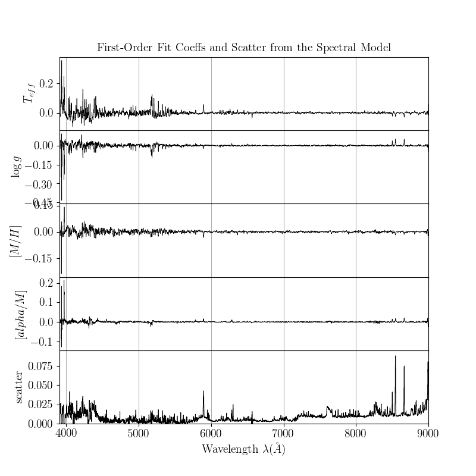
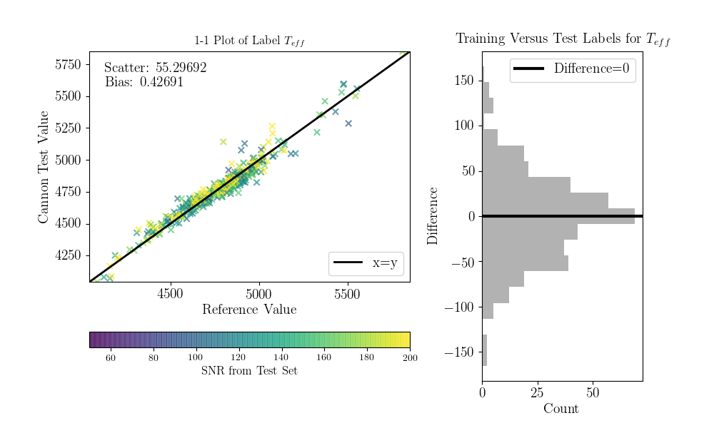
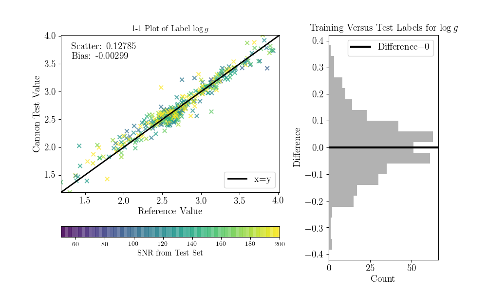
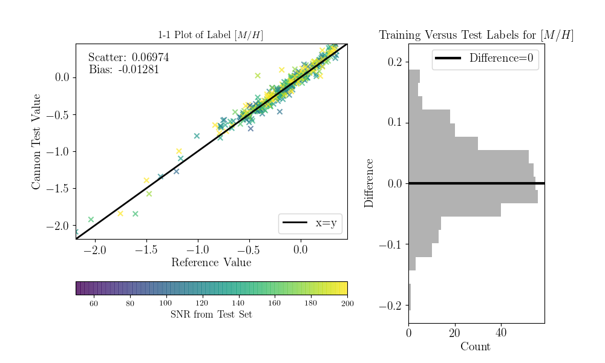
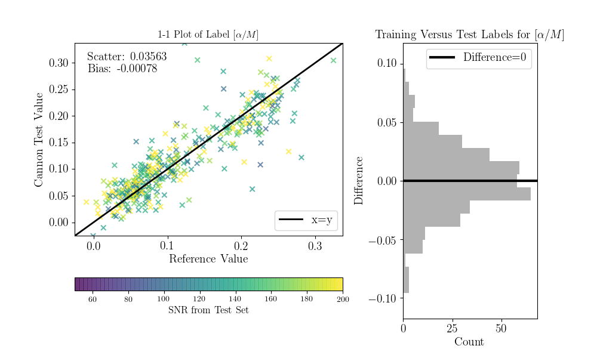

.. _lamost_tutorial:

*********************************
Tutorial with LAMOST DR2 Spectra
*********************************

In this tutorial, we're going to use *The Cannon*
to transfer a system of labels from APOGEE to LAMOST. 
More specifically, we're going to model LAMOST spectra as a function of 
four labels from APOGEE DR12 (the 12th data release): 
effective temperature T_eff, surface gravity logg, metallicity [Fe/H], 
and alpha enhancement [alpha/Fe].
To fit this model, we will use a *reference set*,
a set of stars observed in common between APOGEE
and LAMOST.
We will then be able to use this model 
to determine these four APOGEE-scale labels
from any new LAMOST spectrum, 
provided that the parameters of that star lie
within the range of the reference set.
For more details on this procedure,
see the accompanying paper `Ho et al. 2017`_.

As described in that paper,
there are 11,057 objects measured in common between APOGEE and LAMOST.
For the purpose of this tutorial, to speed things up,
we're only going to use the highest-SNR subset of the LAMOST spectra,
those with SNR > 100. This SNR cut leaves 1387 stars.

The spectra for those 1387 stars can be found in the folder
``lamost_spectra``, which you can download by clicking
:download:`here <lamost_spectra.zip>`. You can unzip the files using
the command

    $ unzip lamost_spectra.zip

Next, navigate into the ``spectra`` directory
and count the number of files using

    $ ls | wc -l

There should be 1387 files, one for each SNR > 100 spectrum.

Since all of these stars were observed both by APOGEE and by LAMOST,
each one has: 
a spectrum measured by APOGEE, 
a spectrum measured by LAMOST, 
a set of parameters measured by the APOGEE pipeline using the APOGEE spectrum,
and a set of parameters measured by the LAMOST pipeline using the LAMOST spectrum.
In this tutorial, our goal is to fit a model that can, directly from a LAMOST spectrum,
measure a set of parameters consistent with those that *would* have been 
measured by the APOGEE pipeline from the corresponding APOGEE spectrum.
In other words, even without an APOGEE spectrum for a star, we aim to measure
a set of parameters that is on the physical scale of APOGEE stellar labels.
Thus, this amounts to a kind of cross-calibration between the two surveys.

We will use 1000 of our 1387 stars to train the model
(these 1000 stars constitute our *reference set*)
then test the model on the remaining 387 objects
(these 387 stars constitutes our *test set*).
At the end, we will check our Cannon values for the
test set by comparing them to the real APOGEE DR12 values
for these 387 objects.
So, in summary: in addition to the spectra from LAMOST that we already downloaded,
we need reference labels from APOGEE DR12,

Before the data can be run through ``TheCannon``, it must be prepared
according to the specifications laid out in the `Requirements for Input`_
section. 
As you can see on that page, the wavelength grid, reference set,
and test set all need to have particular dimensions.
Furthermore, the data must be normalized
in a SNR-independent way.
Shaping the data to the right dimensions is left to the user,
as it depends on the particular application.
Here we provide some simple functions particular to LAMOST spectra.
We also illustrate a build-in option from ``TheCannon`` 
for normalizing LAMOST spectra.

You can download the APOGEE labels for these 1387 objects by clicking 
:download:`here <lamost_labels.fits>`.
Let's use the ``astropy`` module to examine the contents of this file.

>>> from astropy.table import Table
>>> data = Table.read("lamost_labels.fits")
>>> print(data.colnames)

You'll see that the first column is called ``LAMOST_ID``,
and the rest are ``RA``, ``Dec``, ``APOGEE_ID``,
``TEFF``, ``LOGG``, ``PARAM_M_H`` and ``PARAM_ALPHA_M``.
All of these stars were observed by both LAMOST and APOGEE,
which is why they have a LAMOST ID as well as an APOGEE ID.
The Teff, logg, [M/H], and [alpha/M] values are taken from
APOGEE.

Let's take a look at the data.

First, we'll plot one spectrum.
The ``load_spectra`` module in ``TheCannon`` code
provides a way to load the data.

>>> from TheCannon.lamost import load_spectra

The filenames of the spectra correspond to the IDs in the LAMOST_ID column
described above. Let's pick the first one:

>>> filename = data['LAMOST_ID'][0].strip()

You need the ``strip()`` at the end to get rid of white spaces.

Load the spectrum by feeding the filename into the ``load_spectra`` function.
This function returns an array of wavelength values,
an array of corresponding flux values at each wavelength,
and an array of corresponding inverse variance values at each wavelength.

>>> wl, flux, ivar = load_spectra("spectra/" + filename)

Plot the spectrum, first importing ``matplotlib``:

>>> import matplotlib.pyplot as plt
>>> plt.step(wl, flux, where='mid', linewidth=0.5, color='k')
>>> plt.xlabel("Wavelength (Angstroms)")
>>> plt.ylabel("Flux")

You can look at the spectrum either using 

>>> plt.show()

Or by saving the file and then opening it using whatever you usually use
to view .png files:

>>> plt.savefig("lamost_sample_spec.png")

This is what it should look like:

.. image:: lamost_images/lamost_sample_spec.png

Now, instead of loading only one spectrum 
we'll load the whole set of 1387 spectra.

>>> filenames = np.array([specdir+"/"+val.strip() for val in data['LAMOST_ID'])
>>> wl, flux, ivar = load_spectra(filenames)

Let's check the shape of the wl array:

>>> print(wl.shape)

This gives (3626), which tells us that there are 3626 pixels in each LAMOST spectrum.
Next, let's check the shape of the flux and ivar arrays (they should be the same,
since each inverse variance value corresponds to a flux value):

>>> print(flux.shape)
>>> print(ivar.shape)

The shape is [1387, 3626]: [number of objects, number of pixels].
Note that this is consistent with the requirements for the training
and test sets outlined in the documentation.

We'll use the first 1000 stars as the reference set.
Let's define the IDs of the reference set objects,
and pull out their flux values and corresponding inverse variance values.

>>> ref_ID = filenames[0:1000]
>>> ref_flux = flux[0:1000]
>>> ref_ivar = ivar[0:1000]

Now, let's get the corresponding reference labels.

>>> inds = np.array([np.where(filenames==val)[0][0] for val in tr_ID])
>>> ref_teff = data['TEFF'][inds]
>>> ref_logg = data['LOGG'][inds]
>>> ref_mh = data['PARAM_M_H'][inds]
>>> ref_alpham = data['PARAM_ALPHA_M'][inds]

Let's look at the teff-logg diagram of the reference labels,
color-coded by metallicity.

>>> plt.scatter(ref_teff, ref_logg, c=ref_mh, lw=0, s=7, cmap="viridis")
>>> plt.gca().invert_xaxis()
>>> plt.xlabel("Teff")
>>> plt.ylabel("logg")
>>> plt.colorbar(label="M/H")
>>> plt.savefig("ref_teff_logg.png")

This is what this should look like:

.. image:: lamost_images/lamost_ref_teff_logg.png 

Note that there are very few stars at low metallicity,
so it will probably be challenging to do as good of a job
or get as precise results here.

According to the `Requirements for Input`_ section,
we need a block of training labels of dimensions
[num_training_objects, num_labels].
Right now we have them in separate arrays,
so we combine into an array of the appropriate shape:

>>> tr_label = np.vstack((ref_teff, ref_logg, ref_mh, ref_alpham)).T

Check the shape to make sure it matches [num_training_objects, num_labels]:

>>> print(tr_label.shape)

For the test set, we will use the remaining spectra.
Recall that we used the first thousand for the reference set.

>>> test_ID = filenames[1000:]
>>> test_flux = flux[1000:]
>>> test_ivar = ivar[1000:]

Check the sizes:

>>> print(test_ID.shape)
>>> print(test_flux.shape)
>>> print(test_ivar.shape)

There are 387 test objects, each with 3626 spectral pixels, as expected.

Now, all the input data has been packaged properly, and we can begin running
``TheCannon.``

The first step is to initialize a ``Dataset`` object:

>>> ds = dataset.Dataset(
>>> ...wl, ref_ID, ref_flux, ref_ivar, ref_label, test_ID, test_flux, test_ivar)

``TheCannon`` has a number of optional diagnostic plots built-in, to help the
user visualize the results. Some of these plots require knowing the names
of the labels. If the user wants to produce these diagnostic plots, he or
she must specify the label names in LaTeX format: 

>>> ds.set_label_names(['T_{eff}', '\log g', '[M/H]', '[alpha/M]'])

At this stage, two diagnotic plots can already be produced, 
one with the distribution
of SNR in the training and test set (in practice, the training set 
should consist of higher SNR spectra than the test set) 
and the other using ``triangle.py`` to plot
every label's set of training values against every other.  

    >>> fig = ds.diagnostics_SNR()

.. image:: lamost_images/lamost_SNR_hist.png

We can also plot the reference labels against each other:

    >>> fig = ds.diagnostics_ref_labels()

That figure should look like this:

.. image:: lamost_images/lamost_ref_labels.png

Again, ``TheCannon`` requires incoming spectra to be normalized
in a way that is independent of signal to noise. If the data does not satisfy
this criteria already, the user can use the 
functions built into ``TheCannon``. 

>>> ds.continuum_normalize_gaussian_smoothing(L=50)

Let's take a look at a normalized spectrum.

>>> plt.step(ds.wl, ds.tr_flux[0], where='mid', linewidth=0.5, color='k')
>>> plt.xlabel("Wavelength (Angstroms)")
>>> plt.ylabel("Flux")

.. image:: lamost_images/lamost_norm_spec.png

Now, the data munging is over and we're ready to run ``TheCannon``!

For the training step (fitting for the spectral model) all the user needs to 
specify is the desired polynomial order of the spectral model. 
There is also a new functionality in the works that will let the user
incorporate error bars on the reference values, but for now we
turn that off by using ``useErrors=False``.
In this case, we use a quadratic model: order = 2

>>> m = model.CannonModel(2, useErrors=False) 
>>> m.fit(ds) 

At this stage, you can plot the leading coefficients and scatter
of the model as a function of wavelength:

>>> m.diagnostics_leading_coeffs(ds)
>>> plt.savefig("lamost_leading_coeffs.png")

If the model fitting worked, then we can proceed to the test step. This 
command automatically updates the dataset with the fitted-for test labels,
and returns the corresponding covariance matrix.
It's good to use a physical starting guess, which we do below.
In practice, particularly if you are fitting for many parameters,
you should loop through a number of different starting guesses
dsitributed widely through parameter space, and pick the one
that results in the best fit. This will help you get around local minima.

>>> starting_guess = np.mean(ds.tr_label,axis=0)-m.pivots
>>> errs, chisq = m.infer_labels(ds, starting_guess)

You can access the new labels as follows:

>>> test_labels = ds.test_label_vals

And plot them against each other using a triangle plot as follows:

>>> ds.diagnostics_survey_labels()
>>> plt.savefig("lamost_survey_labels.png")

.. image:: lamost_images/lamost_survey_labels.png

Now we can compare the "real" values to the Cannon values, for the test objects.
To do that (this is a bit hack-ish at the moment, sorry) you can set the ``tr_label``
attribute to the "real" label values for the test set.

>>> inds = np.array([np.where(filenames==val)[0][0] for val in ds.test_ID])
>>> test_teff = data['TEFF'][inds]
>>> test_logg = data['LOGG'][inds]
>>> test_mh = data['PARAM_M_H'][inds]
>>> test_alpham = data['PARAM_ALPHA_M'][inds]
>>> test_label = np.vstack((test_teff, test_logg, test_mh, test_alpham)).T
>>> ds.tr_label = test_label

You can now use a built-in function to produce the 1-to-1 comparison plots:

>>> ds.diagnostics_1to1()

.. _Ho et al. 2017: http://iopscience.iop.org/article/10.3847/1538-4357/836/1/5/pdf
.. _Requirements for Input: https://annayqho.github.io/TheCannon/input_requirements.html

